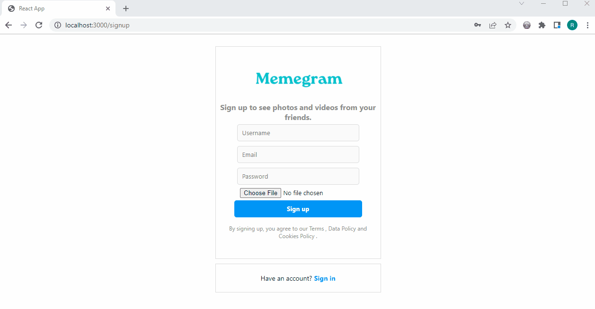
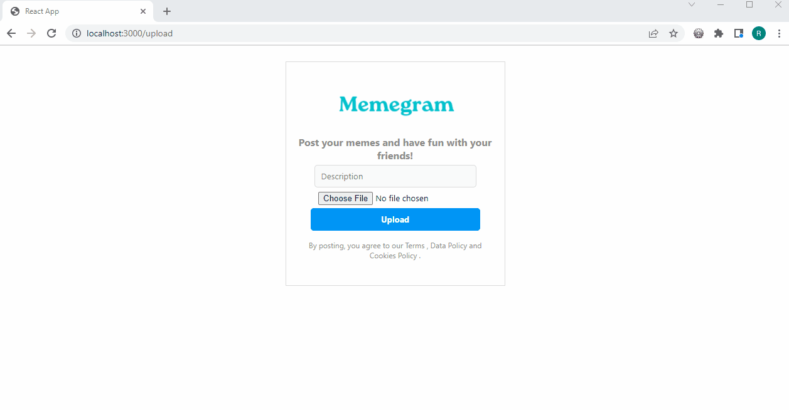
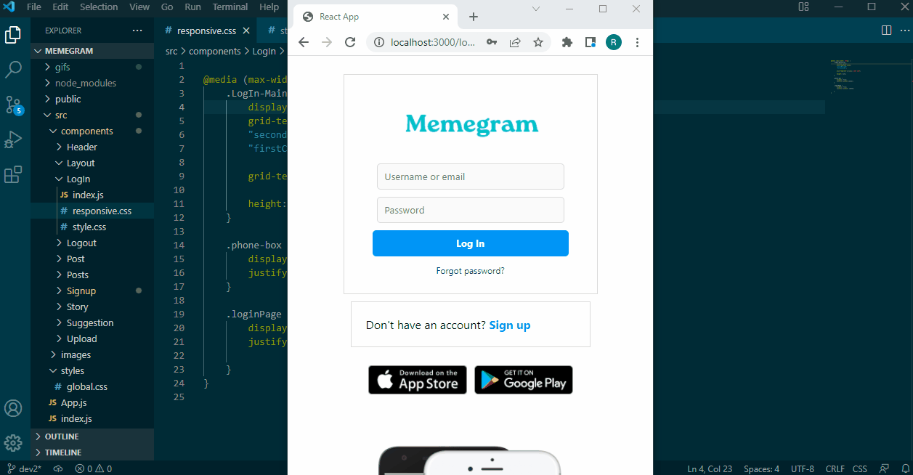
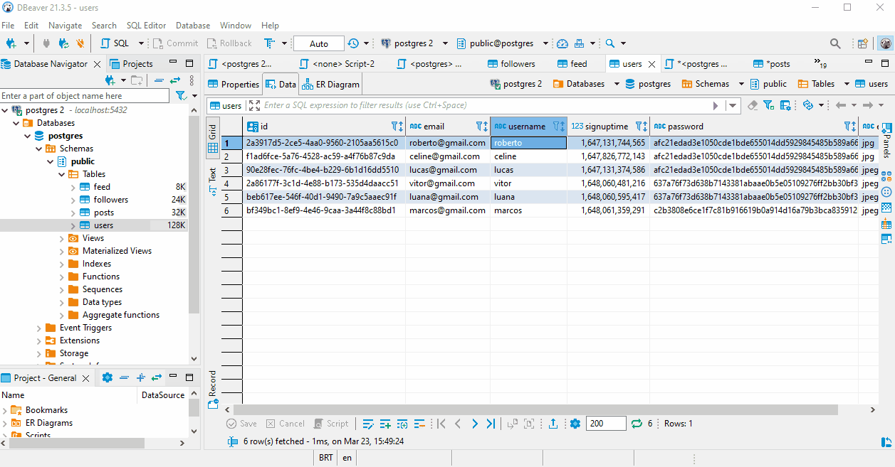

<h1 align="center">
 
  Welcome to the project: Memegram
 
</h1>

This is a Full Stack Instagram clone project for sharing memes with RESTful API developed with React.JS, Node.JS, Express and PostgreSQL.

  <strong>
  This repository is the Front-End part.
  </strong>

## 📲 Creating a new account 

  

 

## 📲 Logging into my account

  

## 📲 Uploading a new meme

  

## 📲 Responsive Web Design

  

## 📲 Back-End

  

## 🚀 Technologies

This project was developed with the following technologies:

- ✔️ React.JS

- ✔️ Node.JS

- ✔️ PostgreSQL

- ✔️ Express

---

Made with 💜 by Roberto Teixeira 👋 [See my linkedin](https://www.linkedin.com/in/roberto-teixeira-developer/)
